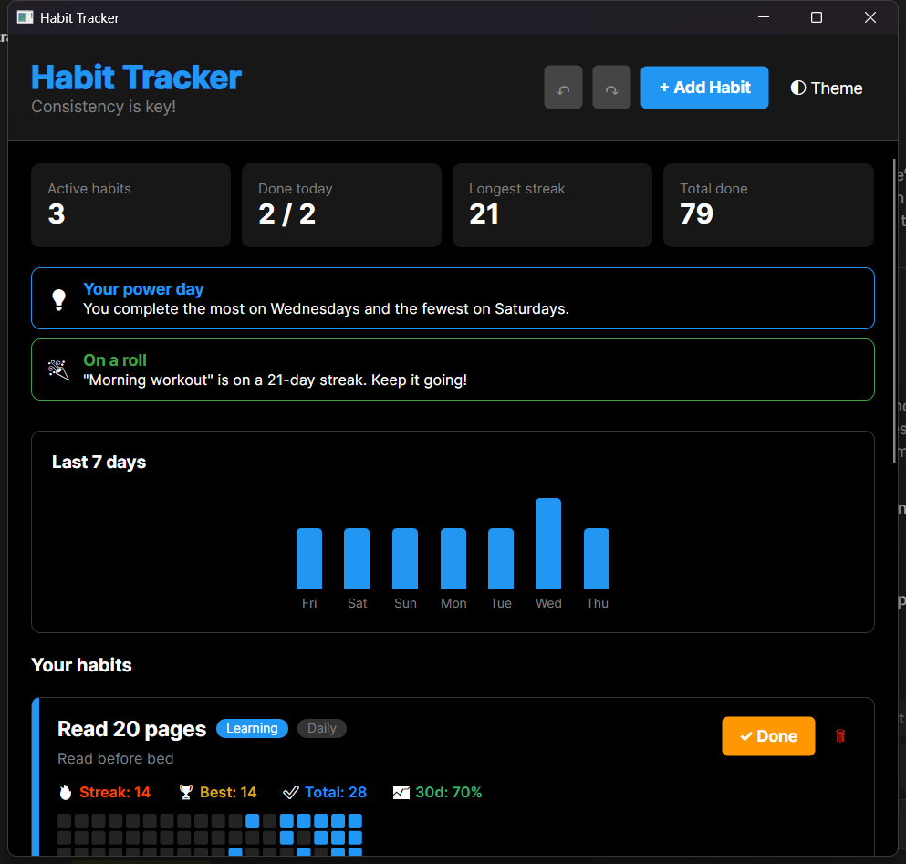
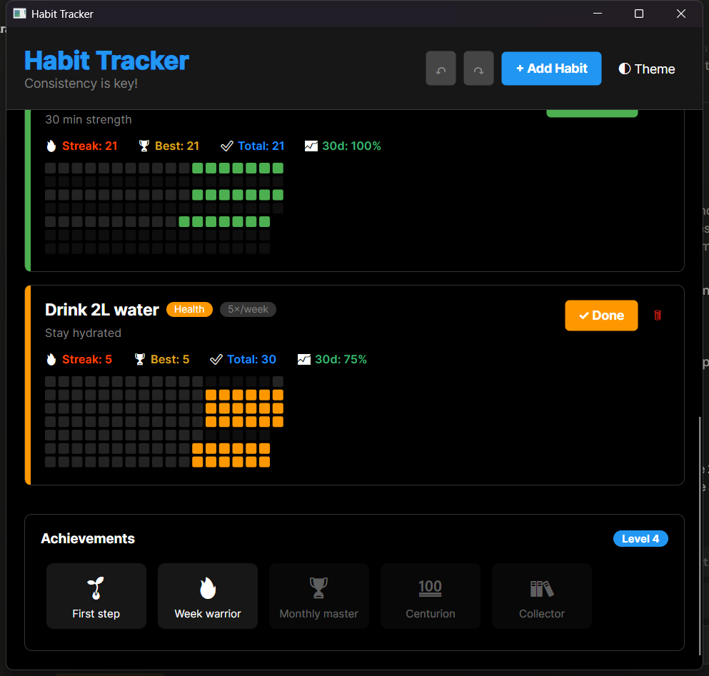

# Habit Tracker — .NET 10 / Avalonia UI

A local-first desktop habit tracker that turns a plain completion log into streaks,
a contribution heatmap, weekly charts, gamified achievements, and automatically
generated insights about your behaviour.



---

## 1. Problem Description

Building good habits is hard without feedback. It's difficult to *see* progress, to
notice when a streak is about to break, or to understand *when* you actually follow
through. This application solves that by letting the user:

- Create habits with a **schedule** (every day, a weekly target, or specific weekdays).
- Mark habits done for the day (with full **undo/redo**).
- See **streaks**, **best streaks**, **30-day completion rate** and a **GitHub-style
  contribution heatmap** per habit.
- Get **smart insights** ("a 12-day streak is at risk", "you complete the most on
  Wednesdays", "these two habits are usually done together").
- Unlock **achievements** and level up.

All data is stored locally as JSON — no account, no network.

## 2. Solution Overview & Features

| Area | What it does |
|------|--------------|
| Scheduling | Daily, *N× per week*, or specific weekdays — each with its own streak rules |
| Tracking | One-click complete/undo, persisted instantly to disk |
| Statistics | Current streak, best streak, total completions, 30-day rate |
| Heatmap | Custom-drawn 18-week contribution calendar, colour-coded by habit |
| Charts | "Last 7 days" activity bar chart |
| Insights | At-risk streaks, strongest/weakest weekday, habit correlations |
| Gamification | Five unlockable achievement badges + an XP level |
| UX | Light/Dark theme toggle, Undo/Redo (buttons + `Ctrl+Z`/`Ctrl+Y`) |

## 3. Architecture & Design Patterns

The project is built around **MVVM** and deliberately demonstrates several classic
software-design patterns:

| Pattern | Where | Purpose |
|---------|-------|---------|
| **MVVM** | `Views/`, `ViewModels/`, `Models/` | Separate UI, presentation logic and data |
| **Dependency Injection** | `App.axaml.cs` (`Microsoft.Extensions.DependencyInjection`) | Compose services and view models; no `new` in the UI layer |
| **Repository** | `IHabitRepository` → `JsonHabitRepository` | Hide persistence behind an interface (JSON today, a DB tomorrow) |
| **Strategy** | `IStreakStrategy` → `Daily/Weekly/SpecificDays` | One streak algorithm per frequency, no `switch` in the model |
| **Factory** | `StreakStrategyFactory` | Map a `Frequency` to its (cached) strategy |
| **Command** | `IUndoableCommand` + `UndoRedoManager` | Encapsulate Add/Delete/Toggle as reversible operations for Undo/Redo |

### Layered flow

```
View (XAML)  ──bindings──▶  ViewModel  ──▶  Command  ──▶  HabitService  ──▶  IHabitRepository  ──▶  habits.json
                                │                              │
                                └── HabitAnalyzer / AchievementService (read-only analysis)
```

## 4. Data Model

The core record is `Models/Habit.cs`. Persisted fields:

| Field | Type | Notes |
|-------|------|-------|
| `Id` | `Guid` | Identity |
| `Name`, `Description`, `Category` | `string` | |
| `ColorHex` | `string` | Per-habit accent colour |
| `Frequency` | `Frequency` enum | `Daily` / `Weekly` / `SpecificDays` |
| `TimesPerWeek` | `int` | Weekly target |
| `ScheduledDays` | `List<DayOfWeek>` | For `SpecificDays` |
| `CompletedDates` | `List<DateTime>` | The full completion history |
| `CreatedAt` | `DateTime` | |

Everything else (`CurrentStreak`, `BestStreak`, `CompletionRate`, `IsDueToday`, …) is a
**computed, non-persisted** property (`[JsonIgnore]`) that delegates to the habit's
`IStreakStrategy`. The history (`CompletedDates`) is the single source of truth; all
statistics are derived from it.

## 5. Detailed Class Description (required by the assignment)

### `HabitAnalyzer` — the insights algorithm

`Services/HabitAnalyzer.cs` reads the completion history and produces a ranked list of
`Insight` objects. The most interesting part is **habit correlation**, which finds the
pair of habits most often completed on the *same* days using the **Jaccard index**:

```
similarity(A, B) = |days A and B both done|  /  |days A or B done|
```

```csharp
int both   = a.Count(b.Contains);          // intersection
int either = a.Count + b.Count - both;     // union
double score = either == 0 ? 0 : (double)both / either;
```

The pair with the highest score (above a 0.5 threshold, with at least 3 shared days) is
reported as *"X and Y are usually done together"*. The analyzer also flags **at-risk
streaks** (a habit due today, not yet done, with a streak ≥ 2) and the user's
**strongest/weakest weekday** by grouping all completions on `DayOfWeek`.

### `WeeklyStreakStrategy` — frequency-aware streaks

`Strategies/WeeklyStreakStrategy.cs` shows why the Strategy pattern is used. A "weekly"
streak isn't consecutive *days* — it's consecutive *weeks that hit the target count*. The
in-progress week never breaks the streak until it ends:

```csharp
if (CountInWeek(habit, thisWeek, 0) >= target) streak++;  // this week, if already met
while (CountInWeek(habit, thisWeek, back) >= target) { streak++; back++; }  // prior weeks
```

### `HeatmapControl` — custom rendering

`Controls/HeatmapControl.cs` is a custom Avalonia `Control` that overrides `Render` to
draw an 18-week grid with the low-level drawing API (no charting library). Each cell is
coloured by querying the habit's strategy: completed → habit colour, due-but-missed →
faint grey, off-schedule → almost invisible. This is why a Mon/Wed/Fri habit shows three
filled columns per week.

## 6. Screenshots & How to Use



1. **Add a habit** — click **+ Add Habit**, enter a name, pick a category and a frequency
   (for *Weekly* choose a target; for *Specific days* toggle the weekdays).
2. **Mark it done** — click **Mark done** on the card (toggles to **✓ Done**).
3. **Undo / Redo** — use the ↶ / ↷ buttons or `Ctrl+Z` / `Ctrl+Y` (deletes are reversible).
4. **Read the dashboard** — summary cards, insight banners, the 7-day chart, per-habit
   heatmaps and the achievements row all update automatically.
5. **Theme** — toggle Light/Dark with the 🌓 button.

## 7. How JSON Storage Works

`JsonHabitRepository` serialises the habit list with `System.Text.Json` (enums written as
strings via `JsonStringEnumConverter`) to:

```
%LocalAppData%/HabitTracker/habits.json
```

It loads on startup and saves after every change. A corrupt/unreadable file is handled
gracefully by starting from an empty list.

## 8. AI Usage in Development

Generative AI was used to *accelerate* development; the design decisions, integration, and
review were done by the author. Tools used:

- **ChatGPT** — initial brainstorming and drafting the architecture/requirements.
- **Gemini Pro (Gemini CLI)** — generated the initial Avalonia MVVM scaffold and the base
  CRUD + streak features, and helped with the Git feature-branch workflow.
- **Claude Code (Claude Opus 4.8)** — designed and implemented the advanced layer:
  the Strategy/Factory streak engine, the DI container + Repository refactor, the
  Command-pattern Undo/Redo system, the `HabitAnalyzer` insights algorithm, and the
  visual dashboard (custom `HeatmapControl`, charts, achievements). Each feature was
  built on its own branch and verified with a real build + run.

> **Note for submission:** the assignment requires the *exact prompts* to be documented.
> Add the specific prompts you used here, e.g.: *"Give me ideas to make my Avalonia habit
> tracker more complex"*, *"Add habit frequencies using the Strategy pattern"*, etc.

## 9. Build & Run

```bash
dotnet build "Habit Tracker/Habit Tracker.csproj"
dotnet run --project "Habit Tracker/Habit Tracker.csproj"
```

Requires the **.NET 10 SDK**.

## 10. Project Structure

```
Habit Tracker/
├── Models/        Habit, Frequency, Insight, Achievement
├── Strategies/    IStreakStrategy + Daily/Weekly/SpecificDays + factory
├── Services/      IHabitRepository, JsonHabitRepository, HabitService,
│                  HabitAnalyzer, AchievementService, DialogService
├── Commands/      IUndoableCommand, Add/Delete/Toggle, UndoRedoManager
├── Controls/      HeatmapControl (custom-drawn calendar)
├── Converters/    Value converters for XAML
├── ViewModels/    MainWindowViewModel, HabitItemViewModel, DayBar
└── Views/         MainWindow, AddHabitWindow
```
